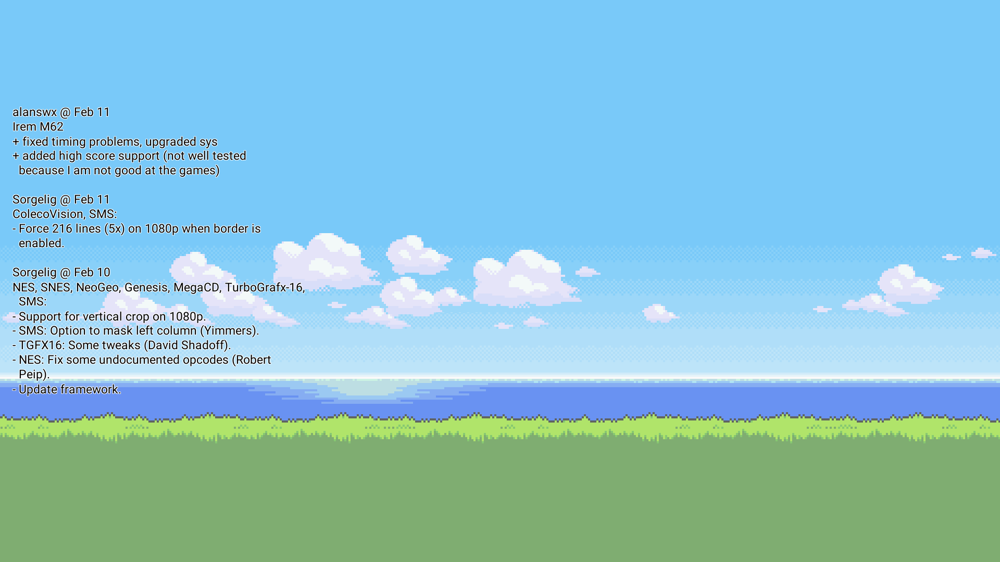

# MiSTress
RSS reader for MiSTer FPGA, changelog displayed on your wallpaper



This is a functioning, simple, easy to use rss reader for the MiSTer FPGA platform. Currently it shows the changelog for the 3 last updates by editing your wallpaper and adding the text to it. There are many things that should be improved and cleaned up here but currently I do not have time to work on this. This program is written in Python but has to be compiled to be able to include the dependencies, more on that below. I originally just wrote this as an excericise in getting to know more python, but it turned out in an excercise in futility compiling python to systems with old glibc. Notes below. Someone asked me to share how I got the changelog on my wallpaper, and I wanted to clean up a bit the files, and document how to pick up developement again as best I can. Feel free to make issues with bug reports, or feature requests, but I don't know if I have time shortly to fix stuff. Merge requests are also welcome.

You will find the precompiled binary in the release section here on github.

## Sideefect

MiSTress runs on boot and checks the rss feed for news, this is really quick but not instant, after MiSTress has updated your wallpaper it will restart the menu core, which results in a small flicker one time each boot. This does not happen when you go from a core back to the menu core.

Also if you use multiple wallpapers, you lose the ability to go to random wallpaper by pressing F1 on the keyboard. This feature I can add back in but it wasn't just a few lines.

# Requirements

1. Internet

# Installation

1. Download mistress from the [release page](https://github.com/sigboe/MiSTress/releases/latest) and copy mistress into your Scripts directory on your mister sd card
2. Rename your wallpaper file from menu.png to wallpaper.png
3. From the Menu core, run the misterss (found with the scripts), answer yes to install the service. This has to be done each time Linux is updated or else the rss feed wont be updated on your wallpaper.

# Uninstallation

1. Run mistress from the menu core, and say yes to remove the service
2. Rename your wallpaper back from wallpaper.png to menu.png, or if you use the wallpaper folder, just remove the menu.png


# Compilation

The compilation is not straight forward, In the future it is possible simpler instructions will be included, or at the very least full instructions. I dont know the compilation dependencies since I made a chroot and installed packages in trial and error. I don't know if it is possible to legally share the raspbian enviornment I have setup to do the compilation, if you have any opinions about that feel free to write about it. Currently this requires a raspberry pi, and building a chroot (basic instructions included) and then installing the (unknown) dependencies into the chroot. I just googled for a while and managed to do it, but I am not sure which packages was needed from the once I installed.
I am sorry to say that currently in my life situation (which includes being a loving father) I don't currently have time to work on the build instructions. But it may be okay for me to share the chroot enviornment with dependencies installed? Checkout pi-chroot-notes.md if you want to build a chroot, and maybe you are proficient in figuring out the build dependencies.

You need to copy the source code and font and maybe spec file into the chroot, The command to compile is as follows

```bash
pyinstaller --hidden-import=packaging.requirements --add-data="Roboto-Regular.ttf:." --onefile --clean mistress.py
```

# TODO

Currently I don't have any short term plans to improve this programs, as I don't have time on my hands. But some of the things that I want to do if I get more spare time soon:

- [ ] Improved handling of the current wallpaper wallaper file, so its easier to install and uninstall.
- [ ] Improve the text handling, to fix edge cases where some text isn't formatted correctly when written on the picture
- [ ] Add an optional options file, to override things like what RSS feed to fetch, how many posts, and maybe more
- [ ] Better handling of multiple wallpapers (random wallpaper feature)
- [ ] supporr for alternate config wallpapers, and folders for random wallpapers for alternate configs.

I don't remember everything, but there is more that I wanted to do
